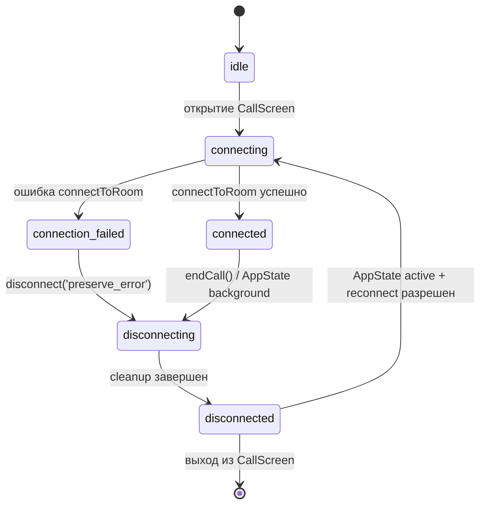

# Флоу звонка

## Обзор

Флоу звонка построен из четырех слоев:

1. `CallScreen` + `useCallSession` (`src/screens/call/`)
2. `MediasoupDemoConnector` (`src/app/webrtc/connector.ts`)
3. `createMediasoupSession` (`src/app/webrtc/session.ts`)
4. `SignalingClient` (`src/app/webrtc/signaling.ts`)

`CallScreen` отвечает за UI, `useCallSession` — за жизненный цикл звонка, `connector` выступает как тонкая прослойка, а `session` управляет mediasoup transport/track ресурсами и очисткой.

## State machine

## Последовательность подключения

1. `useCallSession.connectCall()` переводит `status` в `connecting`
2. `connector.connectToRoom(...)` создает новую mediasoup-сессию
3. `session.createMediasoupSession(...)`:
   - подключает signaling socket
   - получает RTP capabilities роутера
   - создает `send/recv` transport
   - заходит в комнату с `displayName`
   - захватывает локальные аудио/видео треки и публикует их
   - получает удаленные треки через `newConsumer`
4. Локальный и удаленный стримы отдаются в UI через `getLocalStream()/getRemoteStream()`

## Правила реконнекта

- При переходе приложения в `background` запускается disconnect
- При возврате в `active` реконнект выполняется только если прошлое отключение было вызвано `background`
- `connectAttemptIdRef` защищает от устаревших async-подключений, которые могут оживить старую сессию
- После ручного `endCall()` выставляется `shouldReconnectRef = false`, чтобы заблокировать нежелательный авто-реконнект

## Отключение и очистка

При cleanup всегда закрываются:

- producers
- consumers
- индексы consumers по peer
- `send/recv` transport
- локальные/удаленные треки
- подписки signaling на request/notification
- signaling socket

`session.close()` идемпотентен (через `isClosed`), поэтому повторные вызовы безопасны.

## Защита от ошибок

`createMediasoupSession` оборачивает setup в `try/catch`.  
Если инициализация падает на любом шаге, `cleanupSetupFailure()` освобождает все уже созданные ресурсы и только после этого пробрасывает ошибку дальше.

